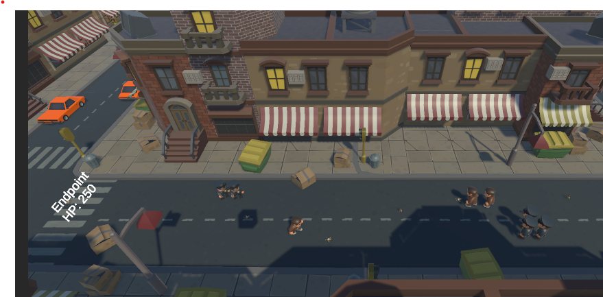
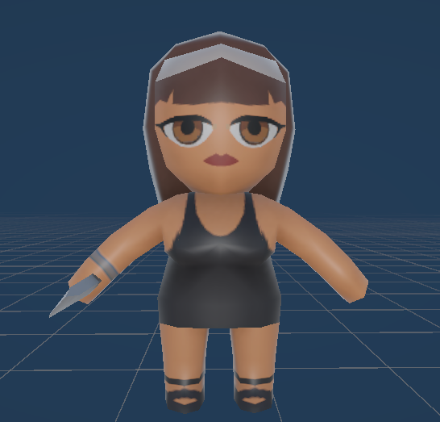
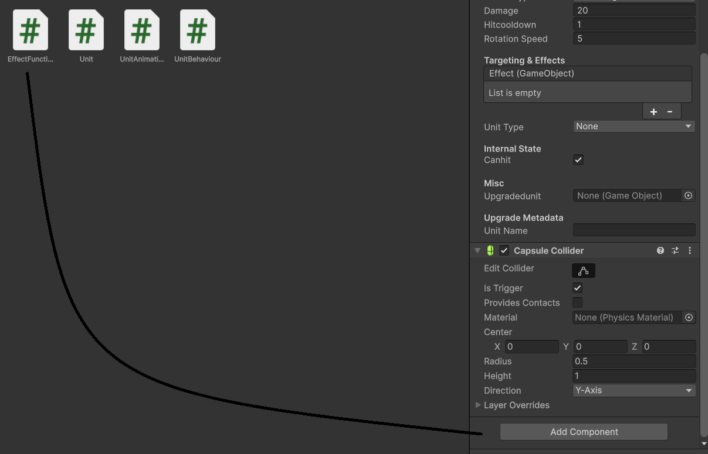
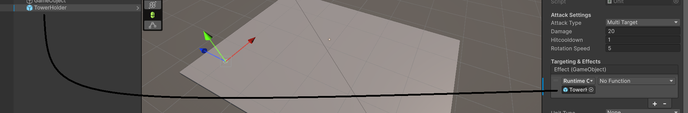
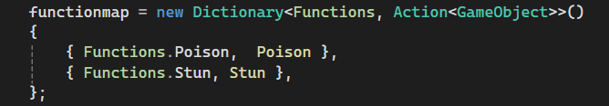
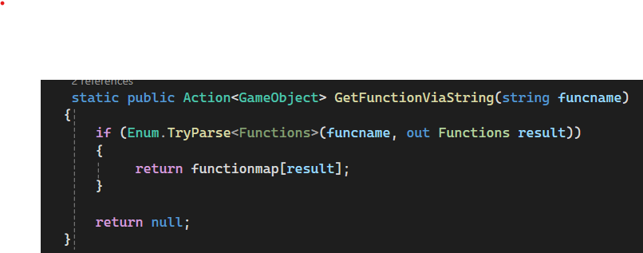
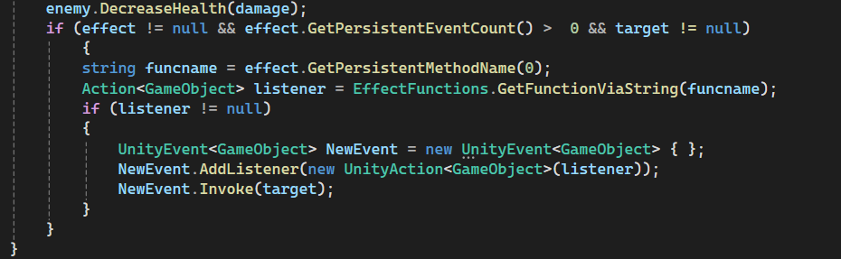

# Tower Defense J_D
Zombie Defense: City Siege
Welcome to J_D's zombie defense:, a tower defense game where your goal is simple: protect the city from waves of relentless zombies and of course have tons of fun!. 

🧟 About the Game
In this project you're tasked with strategically placing defense units to stop the zombies from destroying the city. Each wave gets a bit harder.

🎮 Gameplay and towers
Here's some basic gameplay
  

About the towers:

Base tower (Hank),
Hank is the starting tower, hes a single target unit and does 10 damage and has a cooldown of 1.4 in his base and punches them, 
Upgrade 1: Damage 20, Cooldown 1.5 
Upgrade 2: Damage 35, Cooldown 1.8

  

BatMan,
Well obviously we made a joke of his name being batman because he has well a bat, hes a multi target unit that sweeps with his bat and does 15 damage has a 1.5 cooldown.
Upgrade 1: Damage 30, Cooldown 2
Upgrade 2: Damage 45, Cooldown 2

  
Female (Sandra) is a speicial kind of unit, in her base form she has no special attributes and is single target (18 damage 1.5 cooldown) but in her second upgrade she becomes multi target and has a poisoning effect

Upgrade 1: Damage 36, Cooldown 1.5
Upgrade 2: Damage 52 (+ poison damage), Cooldown 3

  
Police officer (Greg) is a single target unit BUT hes the only unit that can deal damage to "special" enemies (we took insperation from the camo baloons in bloons), special enemys dont get recognized by any other units other then greg, so in the end game greg is very valuable. Damage 34 cooldown 1 in gregs final upgrade hes also able to stun targets

Upgrade 1: Damage 68, Cooldown 2
Upgrade 2: Damage 100, Cooldown 2
  

🛠️ Easy-to-Extend Unit System (For Developers)
The game includes a modular system for creating and customizing new towers, designed with flexibility in mind. Here’s how you can add your own towers:

🔧 How to Add a New Unit using the system
Start with the TowerHolder prefab – drag in your own model or rig.

If the tower has custom behavior, add an [EffectsScript](https://github.com/JuulScripts/Tower-Defense-J_D/blob/main/Assets/Scripts/UnitScripts/EffectFunctions.cs) (located in [Assets/Scripts/UnitScripts](https://github.com/JuulScripts/Tower-Defense-J_D/tree/main/Assets/Scripts/UnitScripts)) 
to the TowerHolder:
  

In the Inspector, go to the Effects & Targeting section.
Link the tower holder as the script in the added targeting & events event.

 
Link the tower holder as the script in the added targeting & events event.

Select which function should be called when the tower attacks (choose EffectsScript).

This setup allows you to rapidly prototype new towers without writing additional scripts for every unique action.

⚠️ UnityEvent vs Delegates: Runtime Function Binding
One technical challenge we faced was that UnityEvents require linked methods to match a specific signature. If your method takes a parameter (like a target), Unity doesn't allow runtime assignment if that parameter is exposed in the Inspector.

To work around this, we used a lightweight function lookup system:

Each custom function is registered in a small dictionary.

At runtime, the linked UnityEvent is "cloned."

The actual target method is fetched and manually added to the new event.

This lets us inject the needed parameters while still using UnityEvents for Inspector usability.

💡 Code Snippets
Here’s where you could add relevant snippets in your README (or link out to full examples)

🔹  Registering functions
### 🖼️ System Overview Screenshots

#### 📂 Function Dictionary & Structure  
  
*Shows the structure of the functions and their naming in the simple database.*

#### 🔁 Fetching & Referencing the Function  
  
*Demonstrates how the function is fetched and referenced at runtime.*

#### 🧩 System in Action  
  
*Shows everything working together.*

💡 Inspiration
The idea started after spotting an asset on the Unity Asset Store. It sparked the whole concept and grew into what you're seeing now.

🎓 School Project Background
This game was developed as part of a 9-week school project (we did it in about two weeks) focused on building a small, playable game using proper workflow, comunication and proper usage of github. The assignment was to create a tower defense game—something simple but fun, inspired by classics like Warcraft III and Plants vs. Zombies.

We worked in a small duo and focused on applying clean code practices, experimenting with new techniques, and building a few custom systems (like our modular tower setup). The goal was to learn by doing—and build something we’d actually want to play.